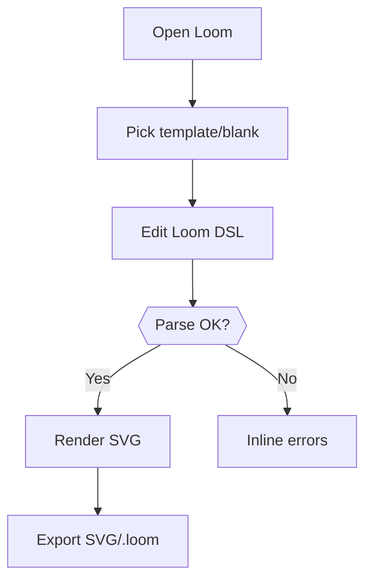

# PRD.md — Loom: A Textual Wireframing DSL & Playground (No-Backend MVP)

## 1. Executive Summary
- **Product Title**: Loom
- **One-line Description**: Mermaid-simple markup that renders modern, grid-perfect wireframes to SVG—clean defaults, optional style blocks—inside a Next.js playground.
- **Document Version & Date**: v1.1 — November 13, 2025

### TL;DR
Loom is a concise DSL for wireframing with a companion playground. It focuses on **clean syntax**, **expressive layout**, and a **separate, compact styling model** (à la Mermaid), all running **entirely in the browser**. No auth, no persistence, no analytics in MVP.

## 2. Problem Statement
### Current State Analysis
- Visual tools excel at fidelity but falter at repo-native, text-first workflows.
- Existing text diagram tools are layout-limited or not UI-oriented.
- HTML/CSS prototypes are verbose and slow to iterate for early ideation.

### Problem Impact & Severity
- Friction in RFCs/PRs; non-diffable artifacts; slow loops.

### Opportunity Size
- Engineer–designer hybrids, staff ICs, PMs who prefer docs-as-code; tens of thousands of practitioners globally.

## 3. Solution Overview
### Proposed Approach
- A grid-first DSL with stack containers and terse alignment/placement tokens.
- A style system separated from content using a **`style` block** and **selectors** (types, ids, classes), concise like Mermaid’s `init`/`classDef` but UI-focused.
- Next.js app with left editor, right SVG preview. Export SVG and local download of `.loom` files.

### Key Differentiators
- **Concise yet expressive**: `@c5 s4 rs2 at:c/m` beats verbose HTML.
- **Modern clean default skin**: subtle strokes, rounded corners, smart spacing.
- **Styling separation**: small, readable style rules; theme tokens and variables.

### Technical Feasibility
- All client-side. Parser + layout + SVG render are tractable and fast in JS/TS.

## 4. Goals & Non-Goals
### Primary Objectives
1. Define and implement **Loom DSL v1** (layout + components).
2. Define and implement **Loom Style v1** (separate styling).
3. Build a **browser-only playground**: edit → preview → export.
4. Provide **templates** and a **reference** page.
5. Achieve **sub-200ms** P95 re-render for typical docs (≤300 nodes).

### Success Criteria
- P95 parse+render < 200ms on modern laptop.
- Export SVG works offline.
- ≥5 templates bundled; zero-config first-run.

### Explicit Non-Goals (MVP)
- Authentication, persistence, collaboration, or analytics.
- Complex widgets (date picker, charts, virtualized tables).
- HTML export (nice-to-have later).

## 5. Users & Personas
### Primary Users
| Persona | Characteristics | Goals | Pain Points |
|---|---|---|---|
| UX Engineer | Codes daily; writes RFCs | Fast, diffable wireframes | HTML/CSS verbosity |
| Staff/Principal IC | Owns design docs | Communicate structure quickly | Tool sprawl, version drift |
| PM/Tech Writer | Docs-first | Easy-to-read diagrams | Overhead of high-fidelity tools |

### Secondary Users
- Eng managers, QA leads.

### User Journey
1. Open playground → choose template or blank.
2. Edit DSL → see live SVG; errors show inline.
3. Export SVG or download `.loom` source.

## 6. Requirements
### Functional Requirements (MoSCoW)
**Must-have**
- Live editor with debounced parsing and immediate SVG render.
- **Layout**: `grid`, `hstack`, `vstack`, `zstack`; placement `@c s r rs`; alignment `at:c/m` etc.; spacing tokens `gap`, `pad`.
- **Components**: `card`, `text`, `input`, `button`, `image`, `icon`, `spacer`, `list` (static), `tabs` (static).
- **Style system**: `style` blocks; selectors (`type()`, `#id`, `.class`); theme variables; two built-in skins: `clean` (default), `sketch`.
- **Export**: SVG download; `.loom` (plain text) download/upload.
- **Templates**: at least 5 (login, dashboard, settings, detail, form).

**Should-have**
- Breakpoints: `when <600 { ... }`, `when >=1024 { ... }`.
- URL-based share (optional): compress DSL into URL hash.
- Simple guides/rulers toggle.

**Could-have**
- PNG export via client (canvas).
- Component macros: `component Button(txt, kind=primary) { ... }`.

**Won’t-have (MVP)**
- Any server features; real interactivity; data-binding.

### User Stories & Acceptance Criteria
1. **As an author**, I write Loom and view updated preview within 200ms.
   - *AC*: Debounced re-render; P95 < 200ms for 300 nodes.
2. **As a reader**, I understand the diagram via modern clean defaults.
   - *AC*: Default theme renders with readable hierarchy, contrast, spacing.
3. **As a user**, I restyle globally without touching content.
   - *AC*: `style default { ... }` changes reflect across nodes; selectors apply.
4. **As a user**, I export artifacts offline.
   - *AC*: SVG and `.loom` file downloads work without network.

### Non-Functional Requirements
- **Performance**: See above.
- **Reliability**: Deterministic layout; same input → same output.
- **Portability**: Works in latest Chrome/Edge/Safari/Firefox.

## 7. User Experience
### Key User Flows


### Information Architecture
- **/play** (editor)
- **/docs** (grammar & style reference)
- **/examples** (templates)

### Responsive
- Stack panels on small screens; resizable split on desktop.
- Keyboard shortcuts for run/export.

## 8. Constraints & Dependencies
- Next.js 15 (App Router), shadcn/ui, Hugeicons, Framer Motion.
- No backend; entirely client-side.
- Optional: LZ-string (or similar) for URL sharing.

## 9. Risk Assessment
| Risk | Prob. | Impact | Rating | Mitigation | Contingency |
|---|---:|---:|---:|---|---|
| Grammar bloat | Medium | High | **M/H** | Strict v1 spec; lint | Defer features to v1.1 |
| SVG perf on large docs | Medium | Medium | **M/M** | Incremental layout; memoization | Virtual canvas or chunking |
| Styling confusion | Low | Medium | **L/M** | Clear style examples; defaults | Style inspector panel |

## 10. Success Metrics & KPIs
- **North Star**: Successful renders per session.
- **Leading**: Template usage; export count.
- **Lagging**: Community adoption (stars/forks later).

## 11. Analytics & Telemetry
- **MVP**: None (explicitly out of scope).
- **Future**: event plan retained from v1.0; not implemented now.

## 12. Security & Privacy
- No network calls; all in-browser.
- SVG sanitization of text; block external images by default (or allow-list).

## 13. Accessibility & Internationalization
- WCAG AA: labeled controls, focus outlines, color contrast.
- Keyboard navigation; live region for parse errors.
- English-only MVP; architecture allows later i18n.

## 14. Milestones & Timeline
- **Phase 1 (Weeks 1–3)**: DSL core + SVG renderer + default skin.
- **Phase 2 (Weeks 4–5)**: Style system, skins, templates.
- **Phase 3 (Week 6)**: Breakpoints, URL share, polish & docs.
- **GTM**: Public repo + demo video end of Week 6.

## 15. Open Questions
- Do we include `icon` with built-in set (Hugeicons) or treat as labeled box only in MVP?
- Do we allow external images (security) or placeholder rectangles only?
- Do we compress DSL to URL by default or behind a toggle?

## 16. Glossary
- **Loom**: the DSL.
- **Skin**: bundled visual theme.
- **Style block**: separate rules affecting appearance.

## 17. Appendices
### A. Loom DSL v1 (Draft)
**Line grammar**
```
<type> "Label"? [#id]? [.class*]? [@c<start> s<cols> r<row> rs<rows>]? [props...]
```
**Placement & alignment**
- `@c5 s4` → start col 5, span 4 cols; row auto.
- `@c1 s12 r1 rs2` → header across top.
- `at:c/m` center/middle; `at:r/b` right/bottom; `at:s/s` stretch.
**Props**
- `gap:<n> pad:<n> w:<n> h:<n> grow shrink radius:<n> tone:<name>`
**Containers & components**
- `grid`, `hstack`, `vstack`, `zstack`, `section`, `card`.
- `text`, `input`, `button`, `image`, `icon`, `spacer`, `list`, `tabs`.
**Examples**
```
grid cols:12 gap:2 pad:3
card "Sign in" @c5 s4 rs3 pad:3
  input "Email"
  input "Password" type:password
  hstack gap:1
    button "Sign in" tone:primary grow
    button "Forgot?" tone:ghost
```

### B. Loom Style v1 (Draft)
- **Global init** (like Mermaid `init`):
```
style default {
  skin: clean      // or sketch
  font: ui-sans    // maps to system font stack
  u: 8             // spacing unit in px
  color.brand: #6D28D9
  color.text: #111827
  color.stroke: #D1D5DB
  color.surface: #FFFFFF
  radius.card: 12
  radius.ctrl: 8
  shadow.card: soft
}
```
- **Selectors**
```
style type(card) { fill: surface; stroke: stroke }
style .primary   { tone: brand }
style #submit    { stroke: brand; text: brand }
```
- **Variables**
```
let gap = 2u
style default { gap: $gap }
```
- **Skins**
  - `clean` (default): subtle stroke, soft shadows, modern typography.
  - `sketch`: dashed strokes, hand-drawn corners (approx via path jitter).

---
[See Development Plan](./DEV_PLAN.md)
